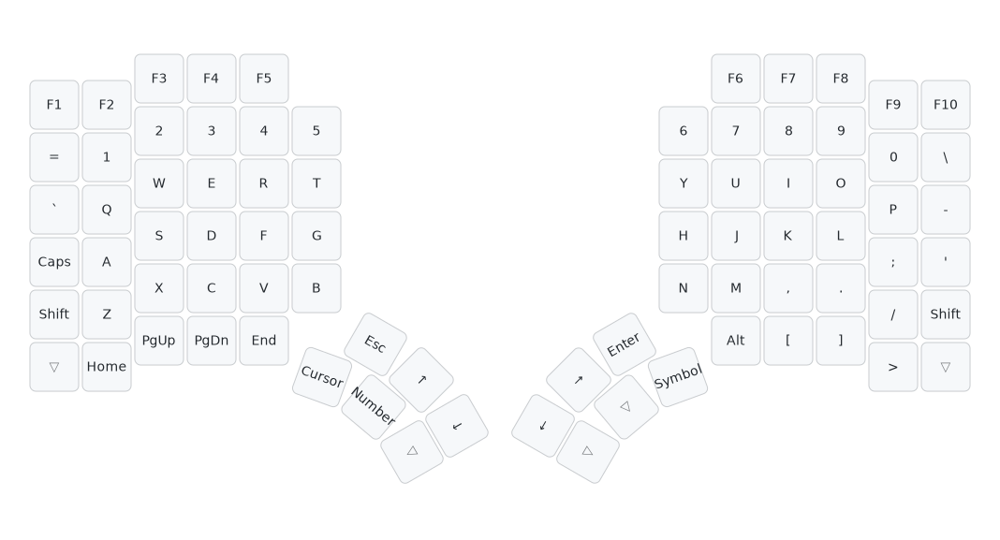
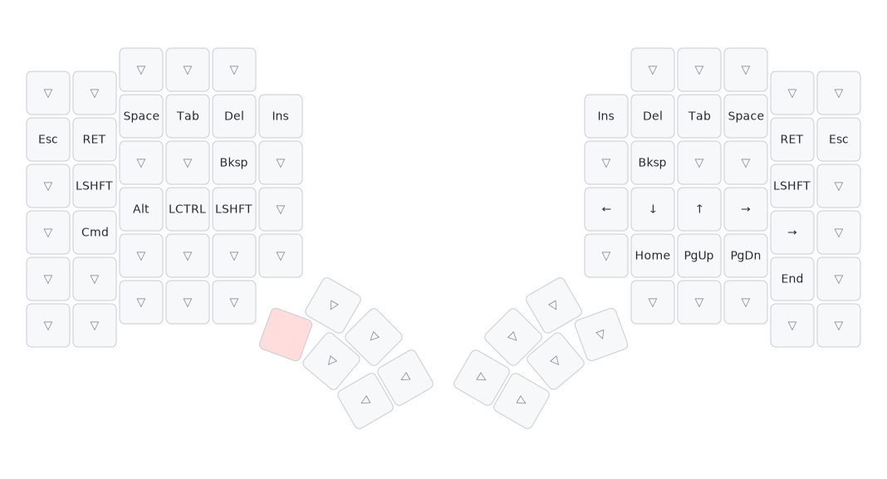
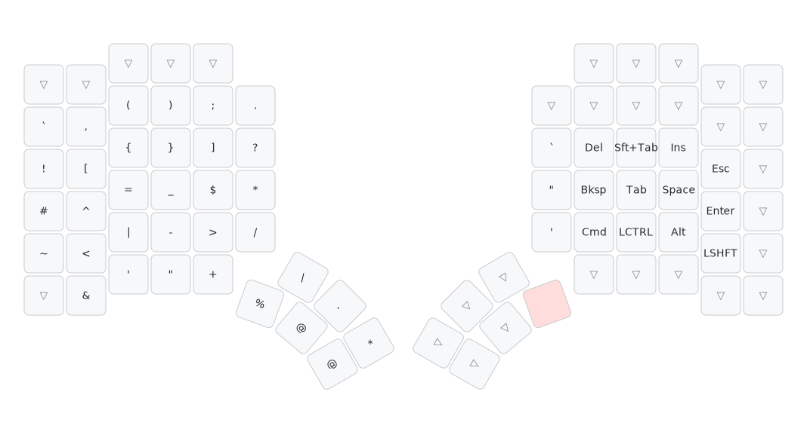

# Glove80 Keyboard

The MoErgo Glove80 is a split ergonomic keyboard with 80 keys, powered by ZMK firmware. This configuration uses a simplified 4-layer setup optimized for development work.

**Keymap File**: `glove80/glove80-simple.keymap`

---

## QWERTY Layer



The base typing layer with standard QWERTY layout. Key features:

- **F-keys Row**: F1-F10 function keys across the top
- **Number Row**: Numbers 1-0 with symbols (=, \)
- **Alpha Keys**: Standard QWERTY letter layout
- **Modifiers**: Caps Lock, Shift keys on home positions
- **Arrow Cluster**: Dedicated arrow keys in center (↑↓←→)
- **Thumb Clusters**:
  - Left: Navigation (Home, PgUp, PgDn, End) + Layer access (Cursor, Number)
  - Right: Layer access (Symbol) + Modifiers (Alt) + Brackets

---

## Number Layer


Numeric keypad and function keys layer, activated via thumb key. Optimized for:

- **Right Hand Number Pad**: Traditional numpad layout (7-8-9, 4-5-6, 1-2-3, 0)
- **Arithmetic Operators**: +, -, *, / positioned around the numpad
- **Symbols**: Mathematical and programming symbols (^, #, $, !, ~, |)
- **Special Characters**: <, >, (, ), [, ], =
- **Left Hand**: Modifiers (Shift, Cmd, Alt, Ctrl) for easy shortcuts

Perfect for spreadsheet work, calculator-style number entry, and mathematical expressions.

---

## Cursor/Navigation Layer



Navigation and browser control layer. Features:

- **Arrow Keys**: Vim-style navigation (←↓↑→) on right hand home row
- **Page Navigation**: Home, End, PgUp, PgDn on right hand
- **Modifiers**: Easy access to Shift, Cmd, Alt, Ctrl on left hand
- **Common Actions**: Backspace, Delete, Tab, Space, Enter, Esc
- **Left Hand**: Mirror positioning for symmetric operation

Ideal for browsing documentation, navigating code, and text selection.

---

## Symbol Layer



Programming symbols and special characters - **[See detailed guide](glove80-symbol.md)**

Quick access to:

- **Brackets**: (), [], {}, <>
- **Operators**: =, +, -, *, /, |, &, ^
- **Punctuation**: !, ?, @, #, $, %
- **Quotes**: ', ", `, ~
- **Special**: \, /, ;, :, ,, .

---

## Customization

To modify your Glove80 layout:

### 1. Edit the Keymap

```bash
# Edit simplified keymap
vim glove80/glove80-simple.keymap
```

### 2. Regenerate Visualizations

```bash
# Parse keymap to YAML
python -m keymap_drawer -c glove80/config.yaml parse -z glove80/glove80-simple.keymap -o glove80/parsed.yaml

# Fix layout name
sed -i '' 's/glove80-simple/glove80/' glove80/parsed.yaml

# Generate individual layer SVGs
python -m keymap_drawer -c glove80/config.yaml draw glove80/parsed.yaml -s QWERTY -o glove80/qwerty.svg
python -m keymap_drawer -c glove80/config.yaml draw glove80/parsed.yaml -s Symbol -o glove80/symbol.svg
python -m keymap_drawer -c glove80/config.yaml draw glove80/parsed.yaml -s Number -o glove80/number.svg
python -m keymap_drawer -c glove80/config.yaml draw glove80/parsed.yaml -s Cursor -o glove80/cursor.svg

# Copy to docs
cp glove80/{qwerty,symbol,number,cursor}.svg docs/keyboard/

# Preview
mkdocs serve
```

### 3. Deploy

```bash
git add . && git commit -m "docs: update glove80 visualization"
git push  # Triggers GitHub Actions deployment
```

---

## References

- **Config**: `.dotfiles/glove80/`
- **Keymap File**: `glove80-simple.keymap`
- **Style Config**: `glove80/config.yaml` (minimal config with default styles)
- **Visualization**: Generated with keymap-drawer v0.22.1 (default light theme)
- **Official Layout Editor**: [my.glove80.com](https://my.glove80.com)
- **ZMK Firmware**: [zmk.dev](https://zmk.dev/)
- **Keymap Drawer**: [github.com/caksoylar/keymap-drawer](https://github.com/caksoylar/keymap-drawer)
